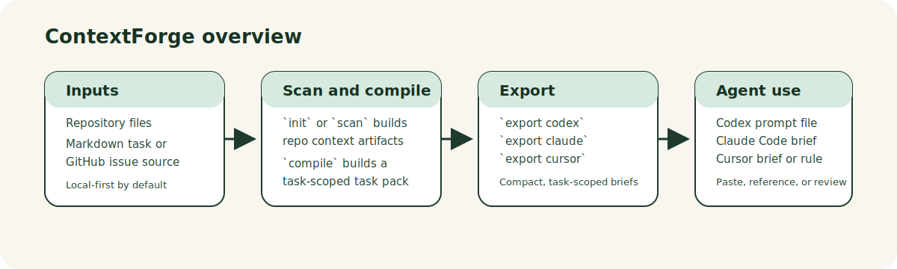
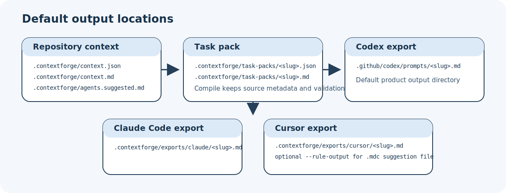

[English](README.md) | [简体中文](README.zh-CN.md)

# ContextForge

ContextForge 是一个本地优先的 repository-to-agent context layer。它会扫描仓库、把任务来源编译成 task pack，并为 Codex、Claude Code、Cursor 导出紧凑的任务简报。



## 适合谁

- 使用编码代理的独立开发者
- 开源维护者
- 需要可重复本地上下文准备流程的小型工程团队

## 解决什么问题

编码代理在缺少正确文件、约束、校验命令和任务边界时很容易走偏。ContextForge 会把这些原本分散的准备工作整理成可检查、可再生成、可提交到仓库的本地产物。

## 工作方式

1. `init` 或 `scan` 扫描仓库，并在 `.contextforge/` 下写入上下文产物。
2. `compile` 把 Markdown 任务或 GitHub issue 来源编译成结构化 task pack。
3. `export` 把 task pack 渲染成面向具体代理的简报。
4. `lint` 检查生成的指导信息是否存在过期引用或薄弱的校验设置。



## 当前支持的导出目标

| 目标 | 命令 | 默认输出位置 | 说明 |
| --- | --- | --- | --- |
| Codex | `contextforge export codex` | `.github/codex/prompts/<slug>.md` | 面向 Codex 工作流的紧凑 prompt 文件。 |
| Claude Code | `contextforge export claude` | `.contextforge/exports/claude/<slug>.md` | 只生成任务简报，不会自动写入 `CLAUDE.md` 或 `.claude/*`。 |
| Cursor | `contextforge export cursor` | `.contextforge/exports/cursor/<slug>.md` | 默认只生成任务简报。只有显式传入 `--rule-output` 时才会写 `.mdc` 建议规则文件。 |

## 快速开始

ContextForge 需要 Node.js 20+。CI 会在 Node 20 和 Node 22 上验证。

```bash
npm ci
npm run build
node dist/cli/index.js init
node dist/cli/index.js compile --input examples/issue-add-command.md
node dist/cli/index.js export codex --input .contextforge/task-packs/add-lint-command.json
```

执行后会得到：

- `.contextforge/` 下的仓库上下文产物
- `.contextforge/task-packs/` 下的 task pack
- `.github/codex/prompts/` 下的 Codex prompt

## Demo 与示例

- 查看 `examples/demo/`，可以直接看到已提交的 task-pack 与导出示例。
- 使用 `examples/issue-add-command.md` 体验本地 Markdown 编译流程。
- 使用 `examples/github-issue-sources.md` 查看 GitHub issue 输入方式。
- 使用 `examples/claude-export-usage.md` 与 `examples/cursor-export-usage.md` 查看代理导出示例。
- 内部 milestone Codex prompt 已归档到 `docs/archive/bootstrap/codex-prompts/`。`.github/codex/prompts/` 现在只保留活跃工作流 prompt 和真实生成的 Codex 输出。

刷新这些精选 demo：

```bash
npm run demo:refresh
```

## 安装、打包与发布检查

本地开发安装：

```bash
npm ci
npm run build
npm link
```

如果不想全局 `npm link`，直接使用 `node dist/cli/index.js` 即可。

本地 tarball 烟雾测试：

```bash
npm run smoke:pack
```

不发布的 publish dry-run：

```bash
npm run publish:dry-run
```

完整发布候选检查：

```bash
npm run release:check
```

生成带版本号的 release handoff bundle：

```bash
npm run release:artifacts
```

该命令会在 `.contextforge/releases/<version>/` 下生成 tarball、包文件清单、release notes 草稿、checksums 和简短的人工交接说明，也可作为 workflow dispatch 前的审阅输入。

之后维护者可以在 version、changelog、仓库权限和 npm publish 配置都准备好后，手动触发 GitHub Actions release workflow。它不会在 push 时自动运行。

## CLI 命令

```bash
contextforge init [--write-agents] [--json]
contextforge scan [--json] [--max-depth 6]
contextforge compile (--input <file> | --github-issue <url|owner/repo#number> | --github-issue-json <path>) [--title <title>] [--json]
contextforge export codex --input <task-pack.json> [--output <file>]
contextforge export claude --input <task-pack.json> [--output <file>]
contextforge export cursor --input <task-pack.json> [--output <file>] [--rule-output <file>]
contextforge lint [--json] [--strict]
```

`contextforge compile` 必须且只能提供一种来源：

- `--input <file>`：本地 Markdown 任务
- `--github-issue <url|owner/repo#number>`：在线抓取 GitHub issue
- `--github-issue-json <path>`：离线 issue JSON 编译

## ContextForge 不做什么

- 不替你写代码，也不替代编码代理本身
- 不做托管 SaaS 或数据库
- 不依赖浏览器 UI 或浏览器自动化
- 不要求核心流程必须有 API key
- 不会在 push 时自动发版、静默 publish，或绕过维护者审查
- 不自动写入 `CLAUDE.md`、`.claude/*`、`.cursor/rules/*` 或旧版 `.cursorrules`
- 不引入重型 RAG、模型训练或后台任务系统

## 维护者文档

- `docs/maintainers/release-checklist.md`
- `docs/maintainers/first-public-release.md`
- `docs/maintainers/first-public-release-checklist.md`
- `docs/maintainers/manual-release-handoff.md`
- `docs/maintainers/npm-publish-guide.md`
- `docs/maintainers/public-metadata-checklist.md`
- `docs/maintainers/release-automation.md`
- `docs/maintainers/feedback-triage.md`

## 反馈与贡献

- 通过 GitHub 内置 issue 模板提交 bug report、feature request 或 workflow feedback。
- 在发起 pull request 之前，先阅读 `CONTRIBUTING.md`，了解本地开发、验证命令和 scope discipline。
- 涉及安全问题时请阅读 `SECURITY.md`，不要在公开 issue 中直接披露可利用细节。

## 开发命令

```bash
npm ci
npm run build
npm run test
npm run lint
npm run smoke:pack
npm run eval:fixtures
npm run publish:dry-run
npm run release:check
npm run release:artifacts
npm run demo:refresh
npm run format
```
